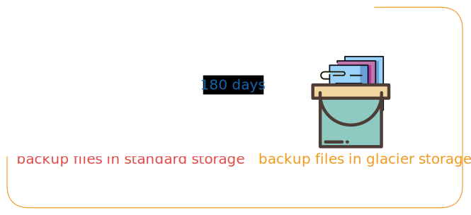

# **How to take backup of all databases from an rds instance running on Postgresql engine**

Here in this document we will explore the code and the process to take backup of all the databases from RDS instances running postgressql engine. This guide is important as the conventional snapshot based RDS backup is only available for 100 snapshots and each snapshot will only last for 35 days thus the necessity to get the database backup prior to 35 days becomes impossible.

## AWS services used

- RDS
- S3
- EC2
- secrets manager
- IAM

## Steps to take backup

### 1. Configure the secrets manager:

- You can directly include rds endpoint and hardcode the connection details to get backup but it is not optimal, if the EC2 server gets compromised so will be the secrets.
- Create the secrets for RDS
   `Secrets manager` > `store a secre`t > `Credentials for Amazon RDS database` > `give user name and password` > `select RDS`
- You will now get the secret string this is the key which will unlock the door to RDS. But without the permission of IAM it cannot.
- Create a Secret manager containing these values so that these values can be extracted by lambda during execution for secure data transfer and for avoiding hardcodes in function.
   - PGHOST
   - PGDATABASE
   - PGUSER
   - PGPASSWORD

### 2. Create an IAM role to be attached to the EC2:

To take backup of RDS databases the bash script will be run on an ec2 instance, thus it needs the permission to access RDS instance(s), S3 bucket where backup will be stored, secrets manager read access to get the details from secrets strings. So we will use the below `policy.json` as an inline policy for the role to be attached to ec2.

- Create a Role
- Attach the inline policy below

```json {"id":"01J7ZTWTPH4SB95G3EE0CA4ZY9"}
{
    "Version": "2012-10-17",
    "Statement": [
        {
            "Effect": "Allow",
            "Action": [
                "s3:GetObject",
                "s3:PutObject",
                "s3:ListBucket"
            ],
            "Resource": [
                "arn:aws:s3:::<Your Backup keeping bucket name>",
                "arn:aws:s3:::<Your Backup keeping bucket name>/*",
                "arn:aws:s3:::<Your Backup logs keeping bucket name>",
                "arn:aws:s3:::<Your Backup logs keeping bucket name>/*"
            ]
        },
        {
            "Effect": "Allow",
            "Action": "rds:*",
            "Resource": "*"
        },
        {
            "Effect": "Allow",
            "Action": "secretsmanager:*",
            "Resource": "*"
        }
    ]
}

```

Note: *Here I have given full access to **secrets manager**, **rds** as i needed to take backup od all rds*

### 3. Preparation of backup EC2:

* Create an EC2 instance with t3.medium as the minimum configuration.
* Use ubuntu 22.04 or more for AMI
* ssh into the server or use SSM agent.
* Install `postgres16` with the following steps

```git-rebase {"id":"01J7ZRKKP5TVBEQ7K1KBATJC05"}
sudo apt update && apt upgrade -y

```

```git-rebase {"id":"01J7ZRSYS98KB3RMF7HBHYKVWF"}
sudo apt install wget gnupg2

```

```git-rebase {"id":"01J7ZRVJCYVR4V985ME2NVHD1D"}
sudo sh -c 'echo "deb http://apt.postgresql.org/pub/repos/apt $(lsb_release -cs)-pgdg main" > /etc/apt/sources.list.d/pgdg.list'

```

```git-rebase {"id":"01J7ZRW5DPHS1XRCRHS3C3J2S1"}
curl -fsSL https://www.postgresql.org/media/keys/ACCC4CF8.asc | sudo gpg --dearmor -o /etc/apt/trusted.gpg.d/postgresql.gpg

```

```git-rebase {"id":"01J7ZRWHMDVD5C7MWDGJJF41MZ"}
sudo apt update

```

```git-rebase {"id":"01J7ZRWWMSHM26S2R2T63DJBV8"}
sudo apt install postgresql-16 postgresql-contrib-16

```

```git-rebase {"id":"01J7ZRX9QJBQQBA3QKXMK05GGW"}
sudo systemctl start postgresql

```

```git-rebase {"id":"01J7ZRXP2GKHNP7793M2J8B8F8"}
sudo systemctl enable postgresql

```

* Create a separate directory to keep the backup script and text file containing secrets string

```markdown {"id":"01J7ZTWTPJER8T3AWDEMK67PZ4"}
backup
├── backup.sh
└── secret
    └── secrets.txt

```

* Use the below script to take backup

```git-rebase {"id":"01J7ZSHFZN2GWJZ7H188PK6BA3"}
#!/bin/bash

# Set variables
S3_BUCKET="< your backup bucket name>"
LOGS_S3_BUCKET="<your backup job logs bucket name>"
REGION="<your region>"
SECRETS_FILE_PATH="./secret/secrets.txt"  # Path to the file containing RDS secret names

# Function to log messages with timestamp
log_message() {
    echo "$(date +"%Y-%m-%d %H:%M:%S"): $1" | tee -a "$LOG_FILE"
}

# Check if psql is installed and compatible
PSQL_CMD=$(command -v psql)
if [ -z "$PSQL_CMD" ]; then
    log_message "psql could not be found, installing PostgreSQL client..."
    sudo yum install postgresql16 -y
    if [ $? -ne 0 ]; then
        log_message "Error: Failed to install PostgreSQL client"
        exit 1
    fi
    PSQL_CMD=$(command -v psql)
fi

# Loop through each secret in the secrets file
while IFS= read -r RDS_SECRET_NAME || [ -n "$RDS_SECRET_NAME" ]; do
    TIMESTAMP=$(date +"%Y%m%d_%H%M%S")
    LOG_FILE="backup_log_${RDS_SECRET_NAME}_$TIMESTAMP.txt"

    # Fetch credentials from AWS Secrets Manager
    log_message "Fetching RDS credentials from Secrets Manager for $RDS_SECRET_NAME"
    SECRET=$(aws secretsmanager get-secret-value --secret-id "$RDS_SECRET_NAME" --region "$REGION" --query SecretString --output text)
    RDS_USERNAME=$(echo $SECRET | jq -r '.username')
    RDS_PASSWORD=$(echo $SECRET | jq -r '.password')
    RDS_ENDPOINT=$(echo $SECRET | jq -r '.host')

    if [ -z "$RDS_USERNAME" ] || [ -z "$RDS_PASSWORD" ] || [ -z "$RDS_ENDPOINT" ]; then
        log_message "Error: Failed to retrieve RDS credentials from Secrets Manager for $RDS_SECRET_NAME"
        continue
    fi
    log_message "Successfully fetched RDS credentials for $RDS_SECRET_NAME"

    # Extract RDS instance name from the endpoint
    RDS_INSTANCE_NAME=$(echo $RDS_ENDPOINT | cut -d'.' -f1)

    # Fetch the list of all databases, excluding `rdsadmin`
    log_message "Fetching list of databases from $RDS_ENDPOINT"
    DATABASES=$(PGPASSWORD="$RDS_PASSWORD" $PSQL_CMD -h "$RDS_ENDPOINT" -U "$RDS_USERNAME" -d postgres -t -c "SELECT datname FROM pg_database WHERE datistemplate = false AND datname != 'rdsadmin';" 2>> "$LOG_FILE")
    if [ $? -ne 0 ]; then
        log_message "Error: Failed to fetch list of databases"
        aws s3 cp "$LOG_FILE" "s3://$LOGS_S3_BUCKET/$RDS_INSTANCE_NAME/$YEAR/$MONTH/$DATE/$HOUR_MIN/$LOG_FILE"
        continue
    fi
    log_message "Databases to back up: $DATABASES"

    # Loop through each database and back it up
    for DATABASE_NAME in $DATABASES; do
        DATABASE_NAME=$(echo $DATABASE_NAME | xargs)  # Trim spaces

        # Generate timestamp components
        YEAR=$(date +"%Y")
        MONTH=$(date +"%m")
        DATE=$(date +"%d")
        HOUR_MIN=$(date +"%H-%M")
        HOUR=$(date +"%H")

        BACKUP_FILE="${DATABASE_NAME}_h_${HOUR}.sql"
        S3_KEY="${RDS_INSTANCE_NAME}/${DATABASE_NAME}/${YEAR}/${MONTH}/${DATE}/${HOUR_MIN}/${BACKUP_FILE}"

        log_message "Backing up database: $DATABASE_NAME"

        PGPASSWORD="$RDS_PASSWORD" pg_dump -h "$RDS_ENDPOINT" -U "$RDS_USERNAME" -C -f "$BACKUP_FILE" "$DATABASE_NAME" 2>> "$LOG_FILE"
        if [ $? -ne 0 ]; then
            log_message "Error: Failed to create backup for database $DATABASE_NAME"
            aws s3 cp "$LOG_FILE" "s3://$LOGS_S3_BUCKET/$RDS_INSTANCE_NAME/$DATABASE_NAME/$YEAR/$MONTH/$DATE/$HOUR_MIN/$LOG_FILE"
            rm "$BACKUP_FILE"
            continue
        fi
        log_message "Backup created: $BACKUP_FILE"

        # Upload the backup to S3
        log_message "Uploading backup to S3: s3://$S3_BUCKET/$S3_KEY"
        aws s3 cp "$BACKUP_FILE" "s3://$S3_BUCKET/$S3_KEY" 2>> "$LOG_FILE"
        if [ $? -ne 0 ]; then
            log_message "Error: Failed to upload backup of database $DATABASE_NAME to S3"
            aws s3 cp "$LOG_FILE" "s3://$LOGS_S3_BUCKET/$RDS_INSTANCE_NAME/$DATABASE_NAME/$YEAR/$MONTH/$DATE/$HOUR_MIN/$LOG_FILE"
            rm "$BACKUP_FILE"
            continue
        fi
        log_message "Backup of $DATABASE_NAME uploaded to S3"

        # Remove the local backup file
        rm "$BACKUP_FILE"
        log_message "Local backup file for $DATABASE_NAME removed"
    done

    # Upload log file to S3 in structured path
    aws s3 cp "$LOG_FILE" "s3://$LOGS_S3_BUCKET/$RDS_INSTANCE_NAME/$YEAR/$MONTH/$DATE/$HOUR_MIN/$LOG_FILE" 2>> "$LOG_FILE"
    log_message "All backups for $RDS_SECRET_NAME complete"

done < "$SECRETS_FILE_PATH"

# Remove all text files in the current directory
rm -f *.txt

```

Use the below command to give it executable permission
```shell
chmod +x backup.sh
```

### 4. Automate the script running

Use cron to run the script when necessary. for example if you want to run on everynight 1 am then use this commands

```sh {"id":"01J7ZTWTPK59S68RCTCVD03XZP"}
crontab -e

```

- paste the following

```sh {"id":"01J7ZTWTPK59S68RCTCXBE55G5"}
0 1 * * * /path/../backup/backup.sh

```

- To check the crons

```sh {"id":"01J7ZTWTPK59S68RCTCZ4QCB3K"}
crontab -l

```

### 5. 4.	Lifecycle management in S3 for appropriate retention period:

In S3 retention period is given in this manner so that we can achieve our retention period without thinking about data being amassing the space in S3 and paying for it at the end.



## Why not use lambda for the purpose

- In Lambda the major yet critical challenge we face is to change the parameter group and turn the force_ssl to 0. Which may become critical from security POV. So, we went with EC2 to avoid any security incompatibility.
- Another problem we would face if we change the parameter group then on modification the RDS instances will reboot which will create downtime.